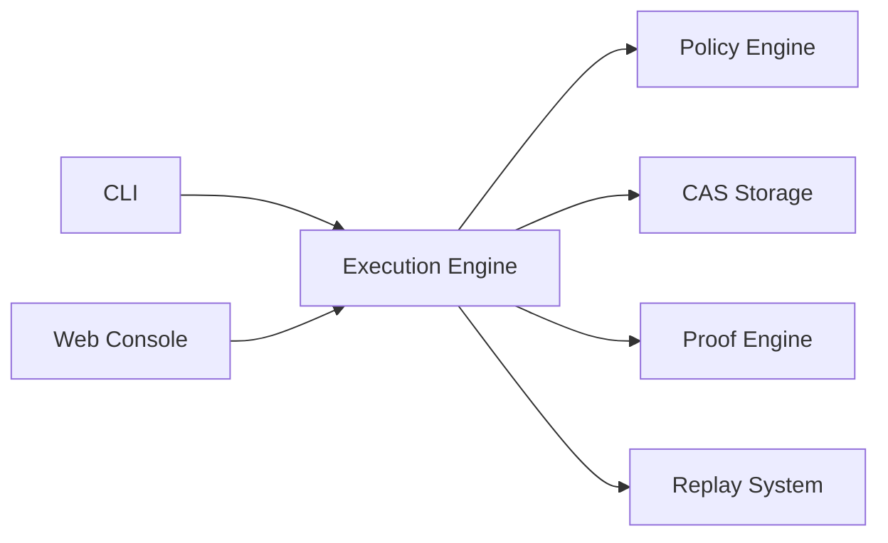

# Requiem (Repository) / ReadyLayer (Product)

[](./LICENSE)


Deterministic execution runtime for agent workflows with policy gating, content-addressed artifacts, replay, and proof-oriented verification.

## 60-Second Quickstart

```bash
# 1) Install + build
pnpm install
pnpm build

# 2) Run end-to-end demo checks
pnpm verify:demo
```

This demo executes the core launch loop: doctor checks, plan verification, run path, and integrity checks.

## Why It Matters

Requiem is designed for situations where logs are not enough and behavior must be reproducible under scrutiny:

- deterministic execution pathways
- replay and replay-diff workflows
- CAS-backed artifact integrity
- policy-as-code decision gating
- proofpack/receipt verification surface

## Architecture (High-Level)



See the concise architecture map: [docs/architecture-overview.md](./docs/architecture-overview.md).

## Demo, Proofpack, and Replay Commands

```bash
# Demo run (creates demo_artifacts/)
pnpm verify:demo

# Inspect generated artifacts
cat demo_artifacts/demo-summary.json
cat demo_artifacts/demo-receipt.json

# Integrity verification surfaces
requiem log verify
requiem cas verify

# Replay surfaces (from CLI docs)
requiem replay run <run_id>
requiem diff replay <run_a> <run_b>
```

Proofpack schema and verification model: [docs/proofpacks.md](./docs/proofpacks.md).

## Launch Readiness Docs

- Launch narrative: [docs/launch-narrative.md](./docs/launch-narrative.md)
- Architecture overview: [docs/architecture-overview.md](./docs/architecture-overview.md)
- Comparison table: [docs/comparison.md](./docs/comparison.md)
- Technical FAQ: [docs/faq.md](./docs/faq.md)
- Explicit limitations: [docs/limitations.md](./docs/limitations.md)
- Demo video script (90–120s): [docs/demo-video-script.md](./docs/demo-video-script.md)
- Product Hunt assets: [docs/product-hunt.md](./docs/product-hunt.md)
- Diligence checklist: [docs/diligence.md](./docs/diligence.md)
- Persona launch review: [docs/launch-surface-review.md](./docs/launch-surface-review.md)

## Naming & Components

| Canonical term | Role | Legacy/alt references |
| :--- | :--- | :--- |
| **Requiem** | OSS runtime/kernel repository and engine | `requiem` (repo/package references) |
| **ReadyLayer** | Web console / control plane | `ready-layer` (workspace/app folder) |
| **Reach CLI** | Command-line interface for verification/replay | `@requiem/cli`, `rl` script |

## Security and Limits (Read Before Production Claims)

- Security posture and hardening status: [docs/THEATRE_AUDIT.md](./docs/THEATRE_AUDIT.md)
- Explicit guarantee boundaries: [docs/limitations.md](./docs/limitations.md)
- Security documentation: [SECURITY.md](./SECURITY.md), [docs/SECURITY.md](./docs/SECURITY.md)

## License & Support

- **License**: Apache-2.0. See [LICENSE](./LICENSE).
- **Support**: See [SUPPORT.md](./SUPPORT.md).
- **Contributing**: See [CONTRIBUTING.md](./CONTRIBUTING.md).
