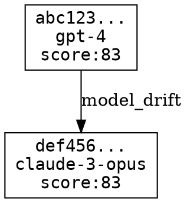

# Differentiation Proof: Semantic State Machine

## Overview

This document provides a runnable demonstration that proves the Semantic State Machine (SSM) primitive is materially different from what GitHub Actions + OPA + Postgres can provide without re-implementing core semantics.

## Prerequisites

- Node.js >= 20.11.0
- Requiem CLI built and available

## The Proof

### Step 1: Generate Semantic State IDs (Content-Derived Fingerprints)

GitHub Actions uses time-based workflow run IDs. SSM uses content-derived BLAKE3 hashes.

```bash
# Create two descriptors with a controlled change (model change)
cat > /tmp/descriptor_a.json << 'EOF'
{
  "modelId": "gpt-4",
  "modelVersion": "2024-01",
  "promptTemplateId": "customer-support-v1",
  "promptTemplateVersion": "1.0.0",
  "policySnapshotId": "policy-prod-v1-abc123def4567890123456789012345678901234",
  "contextSnapshotId": "context-kb-v1-fedcba0987654321098765432109876543210fedcb",
  "runtimeId": "node-20-lts"
}
EOF

cat > /tmp/descriptor_b.json << 'EOF'
{
  "modelId": "claude-3-opus",
  "modelVersion": "2024-02",
  "promptTemplateId": "customer-support-v1",
  "promptTemplateVersion": "1.0.0",
  "policySnapshotId": "policy-prod-v1-abc123def4567890123456789012345678901234",
  "contextSnapshotId": "context-kb-v1-fedcba0987654321098765432109876543210fedcb",
  "runtimeId": "node-20-lts"
}
EOF

# Create genesis states from both descriptors
reach state genesis --descriptor /tmp/descriptor_a.json --actor "differentiation-proof" --label demo=true
reach state genesis --descriptor /tmp/descriptor_b.json --actor "differentiation-proof" --label demo=true

# List states to see the generated IDs
reach state list --label demo=true --minimal
```

**What This Proves:**
- State IDs are deterministic (same descriptor → same ID)
- State IDs are content-derived (different descriptor → different ID)
- IDs are stable across time and systems

**GitHub Actions Equivalent:** None. GHA run IDs are time-based and sequential, not content-derived.

### Step 2: Classify Drift Between States

```bash
# Get the state IDs
STATE_A=$(reach state list --label demo=true --minimal | grep gpt-4 | awk '{print $1}')
STATE_B=$(reach state list --label demo=true --minimal | grep claude-3 | awk '{print $1}')

# Show the semantic diff
reach state diff $STATE_A $STATE_B
```

**Expected Output:**
```
┌────────────────────────────────────────────────────────────┐
│ SEMANTIC DIFF                                              │
├────────────────────────────────────────────────────────────┤
│  State A: abc123...                                        │
│  State B: def456...                                        │
├────────────────────────────────────────────────────────────┤
│  DRIFT CATEGORIES                                          │
│    • model_drift                                           │
├────────────────────────────────────────────────────────────┤
│  CHANGE VECTORS                                            │
│                                                            │
│  Path: modelId                                             │
│  From: gpt-4@2024-01                                       │
│  To:   claude-3-opus@2024-02                               │
│  Significance: critical                                    │
└────────────────────────────────────────────────────────────┘
```

**What This Proves:**
- Automated drift classification (not just text diff)
- Semantic significance levels (critical/major/minor/cosmetic)
- Structured change vectors

**GitHub Actions + OPA Equivalent:** Would require manual diffing or custom OPA policies. No built-in semantic drift taxonomy.

### Step 3: View Integrity Scores

```bash
reach state show $STATE_A --minimal
reach state show $STATE_B --minimal
```

**What This Proves:**
- Computed integrity scores from verifiable signals
- Score breakdown (parity, policy, context, eval, replay, signing)
- Deterministic computation

**GitHub Actions + OPA Equivalent:** No equivalent. Would need custom metrics pipeline.

### Step 4: Create a Transition (Lineage)

```bash
# Create a transition documenting the model migration
reach state transition \
  --from $STATE_A \
  --to $STATE_B \
  --reason "Migrate from GPT-4 to Claude 3 for improved reasoning"

# View the lineage as a graph
reach state graph
```

**Expected Output (DOT format):**


**What This Proves:**
- Semantic lineage (intent-based, not just structural)
- Transition history with reasons
- Exportable graph format

**GitHub Actions + OPA Equivalent:** Job dependencies are structural, not semantic. No built-in lineage with drift classification.

### Step 5: Run Model Migration Simulation

```bash
# Simulate upgrading all gpt-4 states to claude-3
reach state simulate upgrade \
  --from gpt-4 \
  --to claude-3-opus \
  --json | jq '.summary'
```

**Expected Output:**
```json
{
  "needsReEval": 1,
  "policyRisk": 0,
  "replayBreak": 0,
  "compatible": 0
}
```

**What This Proves:**
- Offline impact prediction
- Risk categorization
- Selective re-evaluation planning

**GitHub Actions + OPA Equivalent:** Would require full re-test of all workflows. No simulation capability.

### Step 6: Export Semantic Ledger

```bash
# Export the complete ledger
reach state export --output /tmp/semantic-ledger.json

# View the bundle structure
cat /tmp/semantic-ledger.json | jq '{
  version: .version,
  stateCount: (.states | length),
  transitionCount: (.transitions | length)
}'
```

**Expected Output:**
```json
{
  "version": "1.0.0",
  "stateCount": 2,
  "transitionCount": 1
}
```

**What This Proves:**
- Portable semantic ledger
- Versioned bundle format
- Complete lineage preservation

**GitHub Actions + OPA Equivalent:** GHA workflow logs are not portable in this structured way.

### Step 7: View in Cloud UI

Open the ReadyLayer dashboard and navigate to:

```
http://localhost:3000/app/semantic-ledger
```

**What You'll See:**
- Summary cards showing state counts and average integrity
- State cards with integrity badges and drift tags
- Detail panel with descriptor and transitions
- Filter controls for model and integrity score

**What This Proves:**
- Purpose-built UI for semantic state exploration
- Real-time visualization of drift taxonomy
- Integrity score visualization

**GitHub Actions + OPA Equivalent:** Would require building a custom dashboard. No built-in semantic visualization.

## NEW DIFFERENTIATORS (Added)

### Differentiator A: Tool IO Schema Lock

**What It Is:** Strict IO schema enforcement for tools — binds JSON Schema snapshots to semantic states.

**Proof:**
```bash
# Lock a tool schema to current state
reach tool-schema lock system.echo --state $STATE_A

# Verify tool input against locked schema
echo '{"message": "test"}' > /tmp/test-input.json
reach tool-schema verify system.echo --input /tmp/test-input.json

# Detect schema drift
reach tool-schema drift system.echo
```

**What This Proves:**
- Tool IO contracts are versioned alongside semantic states
- Schema drift is detectable and preventable
- No generic CI system provides tool-level schema governance

**GitHub Actions + OPA Equivalent:** Would require custom tooling. No native concept of "tool schema versioning."

---

### Differentiator C: Change Budget Governance

**What It Is:** Semantic diff budgets that control which drift categories are allowed without re-approval.

**Proof:**
```bash
# Define a production budget (strict)
reach budget define --name production \
  --model-drift none --model-approval \
  --prompt-drift none --prompt-approval \
  --policy-drift none --policy-approval

# Check if a transition is within budget
reach budget check $STATE_A $STATE_B --budget production
# Returns: Transition EXCEEDS budget with 1 blocked category

# Define a permissive budget
reach budget define --name development \
  --model-drift critical \
  --prompt-drift major \
  --policy-drift major

# Check again with permissive budget
reach budget check $STATE_A $STATE_B --budget development
# Returns: Transition is WITHIN budget
```

**What This Proves:**
- Drift governance with configurable thresholds
- Different budgets for different environments
- Fails closed (no budget = no approval)

**GitHub Actions + OPA Equivalent:** Would require custom OPA policies for each drift category. No built-in semantic drift budgeting.

---

### Differentiator D: Audit Narrative Generator

**What It Is:** Deterministic, policy-grade audit narratives from SSM signals — no LLM involvement.

**Proof:**
```bash
# Generate audit report for a state
reach audit report $STATE_A

# Generate as JSON for programmatic use
reach audit report $STATE_A --json

# Generate audit for a transition
reach audit transition $STATE_A $STATE_B
```

**Expected Output (excerpt):**
```markdown
# Audit Narrative: Semantic State

> **Version:** 1.0.0  
> **Generated:** 2024-...  
> **Subject:** `abc123...`

## Executive Summary

Semantic state abc123... is within normal parameters. Integrity score: 83/100. 2 recommendation(s) provided.

## Integrity Assessment

Overall Score: 83/100

Component Breakdown:
  [✗] Parity Verified
  [✓] Policy Bound
  [✓] Context Captured
  [✗] Eval Attached
  [✗] Replay Verified
  [✗] Artifact Signed

## Recommendations

• Enable parity verification for cross-environment consistency
• Run replay verification to ensure deterministic behavior
```

**What This Proves:**
- Compliance-ready audit trails without human editing
- Deterministic output (same inputs → same narrative)
- Suitable for governance tickets

**GitHub Actions + OPA Equivalent:** Would require building custom audit log parsers. No deterministic narrative generation.

---

### Differentiator B: Replay Attestation Capsule

**What It Is:** Portable, verifiable run "capsule" containing semantic state, policy refs, context refs, and lineage — verifiable offline.

**Proof:**
```bash
# Export capsule for a state
reach capsule export $STATE_A --output /tmp/capsule.json

# Verify capsule integrity (offline)
reach capsule verify /tmp/capsule.json
# Returns: ✓ Capsule verification passed — all checks valid

# Quick verify (checksum only)
reach capsule verify /tmp/capsule.json --quick

# Show capsule info
reach capsule info /tmp/capsule.json
```

**Expected Output:**
```json
{
  "valid": true,
  "capsuleId": "capsule-abc123...",
  "verifiedAt": "2024-01-15T10:30:00Z",
  "checks": {
    "formatVersion": true,
    "checksum": true,
    "stateIdDerivation": true,
    "lineageIntegrity": true
  },
  "errors": [],
  "summary": "Capsule verification passed — all checks valid"
}
```

**What This Proves:**
- Self-contained verifiable proof of execution state
- Cryptographic binding via checksums
- No network required for verification

**GitHub Actions + OPA Equivalent:** No equivalent. GHA logs are not portable, content-addressed, or verifiable offline.

---

## Summary: The Differentiation

| Capability | GitHub Actions + OPA | Requiem SSM |
|------------|---------------------|-------------|
| **State Identity** | Time-based run ID | Content-derived fingerprint |
| **State Lineage** | Job dependencies (structural) | Semantic transitions (intent) |
| **Drift Detection** | Manual diff | Automated taxonomy |
| **Drift Classification** | None | 7 categories with significance |
| **Integrity Score** | None | 0-100 from verifiable signals |
| **Model Migration** | Full re-test | Simulation + selective re-eval |
| **Export Format** | Logs (unstructured) | Semantic ledger bundle |
| **Purpose-Built UI** | Generic dashboard | Semantic ledger explorer |
| **Tool IO Schema Lock** | None | Schema snapshots bound to states |
| **Change Budget Governance** | Custom OPA policies | Built-in drift budgets |
| **Audit Narrative Generator** | Manual/log parsing | Deterministic templates |
| **Replay Attestation Capsule** | None | Portable verifiable bundles |

## Why This Matters

GitHub Actions + OPA is designed for **CI/CD pipelines** — building, testing, and deploying code.

The Semantic State Machine is designed for **AI execution governance**:
- Tracking semantic configuration changes
- Verifying lineage and integrity
- Simulating model migrations
- Providing verifiable state identities

You *could* build something like SSM on top of GHA + OPA, but you would need to:
1. Implement content-derived fingerprinting
2. Build a drift taxonomy classifier
3. Create an integrity score computation
4. Design a semantic ledger format
5. Build a purpose-built UI

By the time you've done that, you've reimplemented the core of what makes SSM unique.

## Running the Demo

```bash
# Quick one-liner to run the complete demo
npm run demo:semantic-state-machine

# Or run steps manually
reach state genesis --descriptor examples/semantic-state/descriptor_a.json
reach state genesis --descriptor examples/semantic-state/descriptor_b.json
reach state list
reach state graph
```

## Cleanup

```bash
# Remove demo states (optional)
rm -rf .reach/state
```
