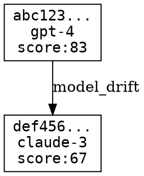

# CLI: Semantic State Commands

## Overview

The `reach state` command family provides first-class operations for the Semantic State Machine primitive.

## Commands

### `reach state list`

List semantic states with optional filtering.

```bash
reach state list
reach state list --model gpt-4
reach state list --min-score 80
reach state list --model gpt-4 --min-score 80 --label env=prod
```

**Options:**

- `--model <model>` — Filter by model ID
- `--policy <policy>` — Filter by policy snapshot ID
- `--min-score <score>` — Filter by minimum integrity score (0-100)
- `--label <key=value>` — Filter by label (can be used multiple times)
- `--json` — Output in JSON format
- `--minimal` — Minimal output format

**Output:**

```
┌────────────────────────┬─────────────────┬────────────┬────────────────────────┐
│ State ID               │ Model           │ Integrity  │ Created                │
├────────────────────────┼─────────────────┼────────────┼────────────────────────┤
│ abc123def4567890      │ gpt-4           │     83/100 │ 2024-01-15T10:30:00    │
│ def789abc1234567      │ claude-3        │     67/100 │ 2024-01-15T09:15:00    │
└────────────────────────┴─────────────────┴────────────┴────────────────────────┘
Total: 2 states
```

### `reach state show`

Show detailed information about a semantic state.

```bash
reach state show abc123def4567890
reach state show abc123  # Prefix matching works
```

**Options:**

- `--json` — Output in JSON format
- `--minimal` — Minimal output format

**Output:**

```
┌────────────────────────────────────────────────────────────┐
│ SEMANTIC STATE                                             │
├────────────────────────────────────────────────────────────┤
│  ID:           abc123def4567890123456789...                │
│  Created:      2024-01-15T10:30:00Z                        │
│  Actor:        system                                      │
│  Integrity:    83/100                                      │
├────────────────────────────────────────────────────────────┤
│  DESCRIPTOR                                                │
│    Model:      gpt-4@2024-01                               │
│    Prompt:     test-template@1.0.0                         │
│    Policy:     abc123def456...                             │
│    Context:    context789...                               │
│    Runtime:    node-20                                     │
└────────────────────────────────────────────────────────────┘
```

### `reach state diff`

Compare two semantic states and show drift taxonomy.

```bash
reach state diff abc123 def456
```

**Options:**

- `--json` — Output in JSON format
- `--minimal` — Minimal output format

**Output:**

```
┌────────────────────────────────────────────────────────────┐
│ SEMANTIC DIFF                                              │
├────────────────────────────────────────────────────────────┤
│  State A: abc123def456...                                  │
│  State B: def789abc123...                                  │
├────────────────────────────────────────────────────────────┤
│  DRIFT CATEGORIES                                          │
│    • model_drift                                           │
│    • prompt_drift                                          │
├────────────────────────────────────────────────────────────┤
│  CHANGE VECTORS                                            │
│                                                            │
│  Path: modelId                                             │
│  From: gpt-4@2024-01                                       │
│  To:   claude-3@latest                                     │
│  Significance: critical                                    │
├────────────────────────────────────────────────────────────┤
│  INTEGRITY                                                 │
│    State A: 83/100                                         │
│    State B: 67/100                                         │
│    Delta:   -16                                            │
└────────────────────────────────────────────────────────────┘
```

### `reach state graph`

Generate a DOT format graph of the state lineage.

```bash
reach state graph
reach state graph > lineage.dot
reach state graph | dot -Tpng > lineage.png
```

**Options:**

- `--json` — Output as JSON with DOT embedded
- `--minimal` — Output raw DOT only

**Output:**



### `reach state export`

Export the semantic ledger as a bundle.

```bash
reach state export
reach state export --output ledger.json
reach state export --since 2024-01-01T00:00:00Z
```

**Options:**

- `--output <file>` — Write to file instead of stdout
- `--since <date>` — Export only states created since date (ISO 8601)

**Output:**

```json
{
  "version": "1.0.0",
  "exportedAt": "2024-01-15T12:00:00Z",
  "states": [...],
  "transitions": [...]
}
```

### `reach state import`

Import a semantic ledger bundle.

```bash
reach state import ledger.json
```

**Output:**

```
Imported 5 new states
Total states in store: 12
```

### `reach state genesis`

Create a genesis state from a descriptor file.

```bash
reach state genesis --descriptor descriptor.json
reach state genesis --descriptor descriptor.json --actor user-123 --label env=prod
```

**Options:**

- `--descriptor <file>` — Path to descriptor JSON file (required)
- `--actor <actor>` — Entity creating the state (default: "cli")
- `--label <key=value>` — Labels to attach (can be used multiple times)

**Descriptor JSON format:**

```json
{
  "modelId": "gpt-4",
  "modelVersion": "2024-01",
  "promptTemplateId": "my-template",
  "promptTemplateVersion": "1.0.0",
  "policySnapshotId": "policy-hash",
  "contextSnapshotId": "context-hash",
  "runtimeId": "node-20",
  "evalSnapshotId": "eval-hash"
}
```

### `reach state transition`

Create a transition between two states.

```bash
reach state transition --from abc123 --to def456 --reason "Model upgrade"
reach state transition --to def456 --reason "Genesis"  # Genesis transition
```

**Options:**

- `--from <id>` — Source state ID (omit for genesis)
- `--to <id>` — Target state ID (required)
- `--reason <reason>` — Reason for transition (required)

### `reach state simulate upgrade`

Simulate the impact of a model upgrade.

```bash
reach state simulate upgrade --from gpt-4 --to claude-3
reach state simulate upgrade --from gpt-4 --to claude-3 --policy policy-v2
```

**Options:**

- `--from <model>` — Source model ID (required)
- `--to <model>` — Target model ID (required)
- `--policy <ref>` — Policy snapshot reference
- `--eval <ref>` — Evaluation snapshot reference

**Output:**

```
┌────────────────────────────────────────────────────────────┐
│ MODEL MIGRATION SIMULATION                                 │
├────────────────────────────────────────────────────────────┤
│  From: gpt-4                                               │
│  To:   claude-3                                            │
├────────────────────────────────────────────────────────────┤
│  SUMMARY                                                   │
│    Total states analyzed: 5                                │
│    Needs re-evaluation:   5                                │
│    Policy risk:           0                                │
│    Replay break:          0                                │
│    Compatible:            0                                │
└────────────────────────────────────────────────────────────┘
```

## Exit Codes

- `0` — Success
- `1` — Error (invalid arguments, state not found, etc.)

## Environment Variables

- `REQUIEM_STATE_DIR` — Override default state directory (default: `.reach/state`)

## Examples

### Complete Workflow

```bash
# Create a descriptor
cat > descriptor.json << 'EOF'
{
  "modelId": "gpt-4",
  "modelVersion": "2024-01",
  "promptTemplateId": "summarizer",
  "promptTemplateVersion": "1.0.0",
  "policySnapshotId": "policy-v1",
  "contextSnapshotId": "context-v1",
  "runtimeId": "node-20"
}
EOF

# Create genesis state
reach state genesis --descriptor descriptor.json --actor developer --label project=demo

# List states
reach state list

# Simulate model upgrade
reach state simulate upgrade --from gpt-4 --to claude-3

# Export ledger
reach state export --output my-ledger.json
```
