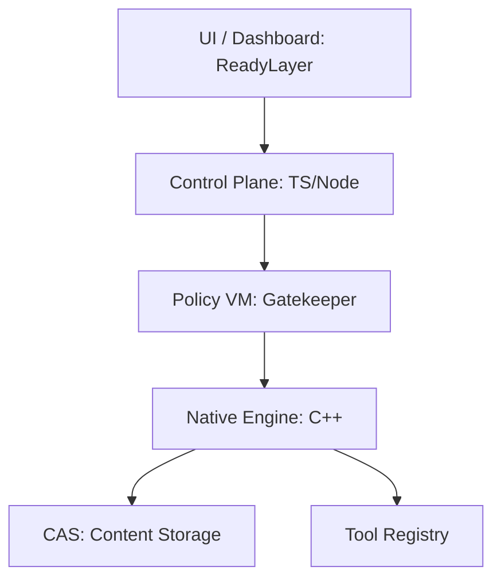

# Enterprise Architecture Overview: Requiem

**Version**: 1.0.0  
**Last Updated**: 2026-03-02

## 1. System Topology
Requiem is composed of three primary layers designed for resilience and auditability.

## 2. Core Components

### 2.1 The Native Engine (C++)
To ensure bit-perfect determinism, the core engine manages the sandbox environment, sanitizes environment variables, and performs high-speed BLAKE3 hashing. It is optimized for sub-10ms overhead.

### 2.2 The Policy VM (Governance)
A declarative governance engine that evaluates every proposed tool call against a set of constraints (Budget, Identity, Content). It follows a **Deny-by-Default** security posture.

### 2.3 CAS v2 (Integrity Layer)
Content-Addressable Storage ensures that every input and output is immutable. By utilizing dual-hashing, we provide 100% verification that data has not been tampered with between execution and audit.

## 3. Integration Patterns
- **CLI-First (Reach)**: Developers integrate `reach` into their local workflows for debugging.
- **API-Integrated**: Production agents call the Requiem runtime via a secure RPC/REST interface.
- **Enterprise Hub**: Multiple clusters sync their receipts to one central ReadyLayer instance for organization-wide visibility.

## 4. Scalability & Availability
- **Horizontally Scalable**: Engines can be spun up across any number of workers.
- **Stateless Execution**: Each run is self-contained via its fingerprint; state is persisted in the global CAS.
- **High Availability**: Control plane supports cluster coordination for zero-downtime policy updates.

## 5. Security Model
Requiem utilizes a "Defense in Depth" strategy:
1. **Process Isolation**: Native sandbox.
2. **Capability RBAC**: Tool-level permissions.
3. **Cryptographic Verifiability**: Merkle-signed traces.
